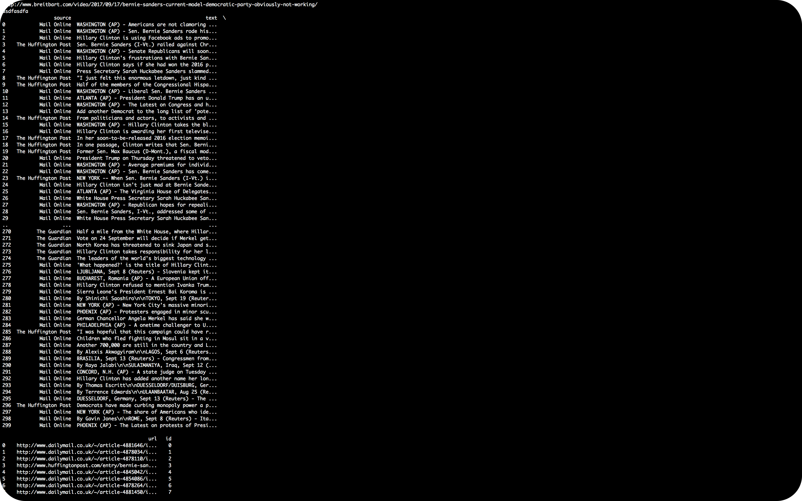
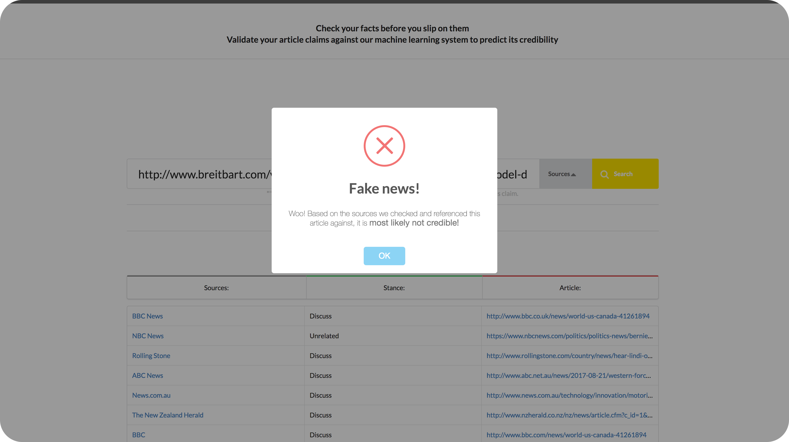

# Real-Time Fake News Flagging

### By :
1. 👩‍💻 [Brendah Malakwen](https://github.com/brendahmalakwen)
2. 👨‍💻 [Gatare Libère](https://github.com/gatarelib)
3. 👩‍💻 [Forum K. Patel](https://github.com/Forum-k-Patel)
4. 👨‍💻 [Phil Matunda](https://github.com/ReckerPhildev)
